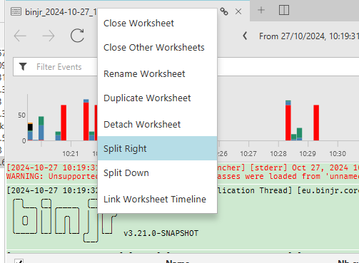

# New UI feature: Splittable visualization area

Binjr has had the ability to detach a tab into a new window to allow the user to view more than one worksheet at a time for a while now, and this has proven to be a really useful feature, especially on multi-monitor setups.

But admittedly, it can be a tad fussy to set up when you want to view several worksheets neatly arranged in a grid on a single screen (unless your window manager is able to handle that for you, that is).
<!-- more -->
So I'm hoping people will find this useful; the ability to split the visualization pane, horizontally or vertically, within the main window.

Of course, the ability to detach a tab into a new window isn't going anywhere, and such windows can now also be split in the same fashion.

Below is an example of what it looks like: 

If you're feeling adventurous, you can even give it a try in the [v3.21.0 Preview build](https://github.com/binjr/binjr/releases/tag/v3.21.0-SNAPSHOT), but please be warned that it is still early days and that it is quite buggy at the moment, and not everything is implemented yet.

To split a view, click on the icon to the right of the tabs to create a new pane to the right, or ALT+click to create a new pane at the bottom.

You can drag series from the source panel to create a new worksheet, or drag an existing tab from onto it. When a split pane is empty, you can discard it by process the top let cross icon.

<video controls  muted src="/assets/videos/splittable_pane_demo.mp4" type="video/mp4"/></video>

Alternatively, you can send an exiting tag into a new split pane directly using the right-click context menu:

To be honest, it's been a while since the last time a brand new UI feature was introduced in binjr, so I'm pretty exited about this one, and I hope you'll like it too. 

In any case, please let me know what you think!
