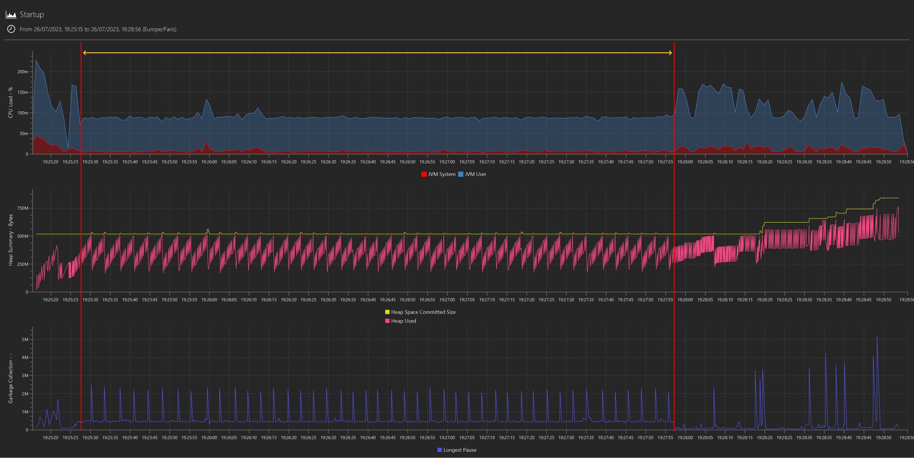
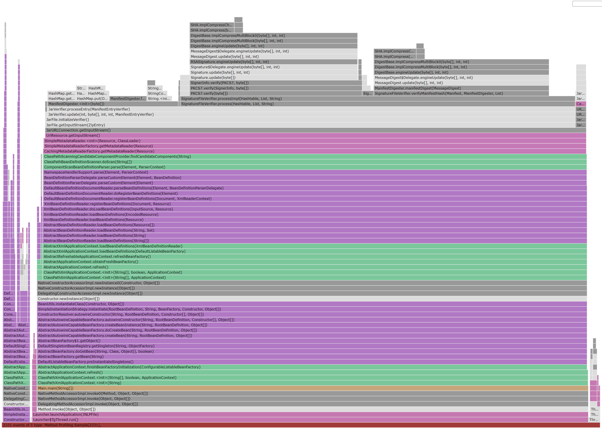

# The benefit of wall clock time data in method profiling

As a companion to our overview of the [new JFR data adapter in binjr](New-adapter-JFR..md), here's an illustration of how having good visualization options for the wall clock time component of method profiling events can help gain deeper insights out of a JFR profile, from a recent Real Life™  investigation.

In this example, we are faced with an application whose startup time increased dramatically following a migration of some pieces in the software stack, to the point of becoming unbearable.

<!-- more -->

### What can we learn from time series (i.e. wall clock time)?
We first plot the standard metrics from a JFR capture, and we can clearly see a pattern in CPU usage, heap statistics and GC  during the startup sequence that singles out a long period where the application seems to be stuck into what looks like a single threaded, repetitive operation in the critical path, preventing any further progress until it is completed:

*(NB: the highlight was "added in post"; I didn't mean to mislead anyone into rejoicing that this has finally been implemented. But it will be. One day. Probably.)*

How can we tell it is single threaded? The CPU usage flat-lining at ~8% on a 12 cores machine is the main tell. And the same kind of operation in a loop? Well, at this stage is it only a hunch, but the regularity in both CPU and mem/GC activity strongly supports it: let's call that "duck profiling" - if it consumes CPU like a duck and allocates memory like a duck, then it is probably a duck (albeit a pretty strange duck).

Then, we can very easily filter out the application's log on the that specific period of time, only to realize the application didn't log anything during that period; lots of events before or after but nothing during (not pictured: nothing to see). 

This strongly suggests all processing is taking place in either the underlying framework (Spring) or the in JVM itself.

### What can we learn from flame graphs (i.e. cpu time)?

Meanwhile, a flame graph (courtesy of JMC) for the complete startup sequence shows it is literally dominated by a single kind of action: the computation of cryptographic hash triggered by jar signature verification:

The flame graph very clearly indicate that this is where most of the CPU time is being spent, but it doesn't really tell us anything about the relationship between the jar verification it highlights and the pattern we see in the plotted metrics. 

### Putting it all together

Once the ability to zoom in on a time interval and produce a flame graph out of those events only is added, we will be able to figure out whether or not there is indeed a link between the two immediately. But until then, what we **can** do it to filter out the method profiling data on the method that we care about in binjr's JFR event view and have a look at the distribution density for these events via the histogram view. 

And in this case, it is indeed quite telling: these events occur predominantly during the time interval we previously identified:

As it turns out, the root cause for all this is [a bad interaction between Spring component scanning and signed jars](https://github.com/spring-projects/spring-framework/issues/9371), a pretty old issue but one that can still bite today, apparently (and, in case you're curious, [this is how you work around it](https://docs.spring.io/spring-framework/reference/core/beans/classpath-scanning.html#beans-scanning-index). Don't ask me more, I know close to nothing about Spring).
