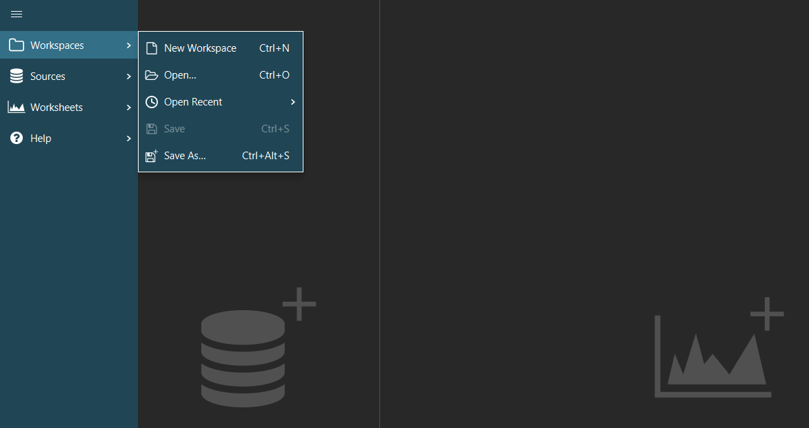

# Managing workspaces

You can save the state of a binjr session at any time, including connected sources, opened worksheets and 
charts.

Such a session is called a "workspace", and it can be stored on disk in a file with a `.bjr` extension, to be reopened 
at a later time.
      
All workspace management features are access from the "Workspaces" entry in the menu bar.

## New Workspace

Select `New Workspace` from the menu (or press `Ctrl+N`) to create a new, blank workspace.

It will close down all previously opened sources tabs and worksheets.

!!! Info "Note"
    If there are any unsaved changes in the current workspace, you will be prompted on whether or not to save your 
    work before closing it. 

## Open

Select `Open...` from the menu (or press `Ctrl+O`) to browse your system for existing workspace and open it.

## Open Recent 

The `Open Recent` sub menu shows a list of the 20 most recently opened workspace; selecting an entry from that list will 
then open it.

## Save

Select `Save` from the menu (or press `Ctrl+S`) to save the current session into a `.bjr` workspace file.

!!! Info "Note"
    If the current session had not been save previously, you will be prompted for a file name and location for the new 
    saved file. 
    
## Saves As

Select `Save As...` from the menu (or press `Ctrl+Alt+S`) to save the current session into a new `.bjr` workspace file; you will always be prompted for a new file name and location.

